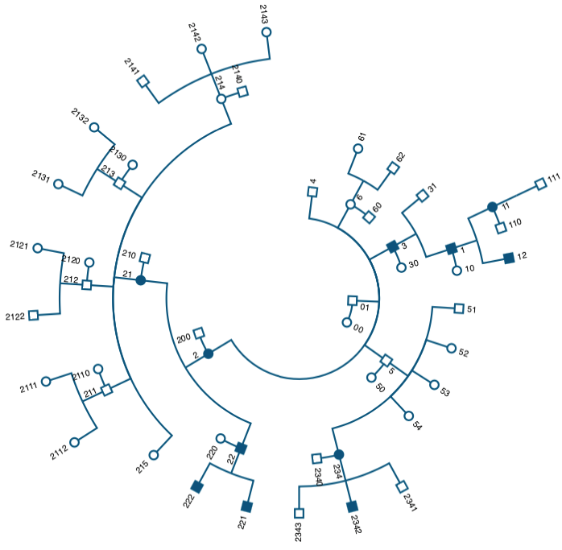

# CircularPedigreeTree

Please refer to `UMOD_PAPER/bash.sh` for how to replicate the figures in our paper. The script `UMOD_PAPER/src/PED2HTML.py` was used to convert a ped file to a html webpage with the circular pedigree rendered in a svg canvas. The python script needs `docopt` package, please install accordingly.

If you find this script helpful for your work, please cite our work.

Chun J*, Wang M*, Wilkins MS, Knob AU, Benjamin A, Bu L, Pollak MR: Autosomal Dominant Tubulointerstitial Kidney Disease–Uromodulin Misclassified as Focal Segmental Glomerulosclerosis or Hereditary Glomerular Disease. Kidney Int. Reports [Internet] 1–11, 2020 Available from: https://doi.org/10.1016/j.ekir.2019.12.016

